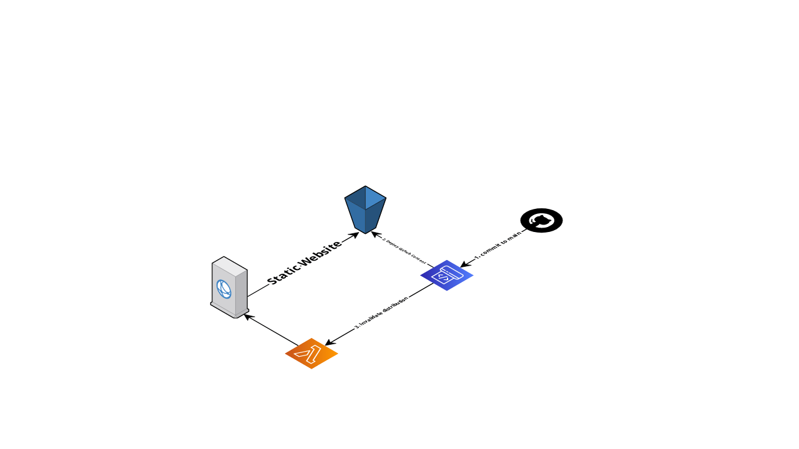

## Requirements

- The infrastructure should be codified using Terraform and provisioned in such a way that it can be redeployed to a different account with minor variable changes.
- S3 should be configured as a static site and used to host the content.
- Amazon CloudFront should be configured to distribute the content from the S3 static site.
- Amazon CloudFront’s default behavior should be configured to not cache.
- Amazon CloudFront should have an additional behavior configured to cache an image for a default / minimum / maximum TTL = 30 minutes.
- Amazon CloudFront should have SSL enabled using the Default CloudFront Certificate
- CodePipeline should be configured in such a way to deploy / update the files for the site.
- CodePipeline should trigger off any commits or pull requests merged to a specific branch of the site’s source code git repository.
- CodePipeline should invalidate the CloudFront Distribution after adding files to the site.

# Terraform setup for S3 Static site, Cloudfront, and Codepipeline

This repository contains a complete deployment for an S3 Static Site setup as the origin for a CloudFront distribution and with the CICD pipelines with Codepipeline to update the S3 bucket files each commit to the main branch and invalidate the cache of the CloudFront distribution.

there are some values that you can customize for this deployment and you can find them in the  `deploy/apply-tfvars/dev.tfvars` file.

## To deploy go to the folder `deploy`

The deployment is made with Terraform, and it was divided into three modules as follows

### 1. S3

S3 module is in charge of the creation and configuration for the S3 bucket as a static website

| Name | Description | Type | Default | Required |
|------|-------------|------|---------|----------|
|bucket_name|part of the name that compuond the S3 bucket name|`string`| |no|
|index_document|path to the index document for the webhost site|`string`| |no|
|error_document|path to the error document for the webhost site|`string`| |no|

Outputs:  
bucket_arn  
bucket_website_endpoint  
bucket_id  

### 2. Cloudfront
Cloudfront module in is charge of the creation of the cloudfront distribution and the two behavior for cache
| Name | Description | Type | Default | Required |
|------|-------------|------|---------|----------|
|price_class|option to select the edge location for the cloudfront distribution, valid values PriceClass_All, PriceClass_200, PriceClass_100|`string`| |no|

Outputs:  
distribution_id  

### 3. Codepipeline
| Name | Description | Type | Default | Required |
|------|-------------|------|---------|----------|
|code_pipeline_name|Name for the codepipeline|`string`| |yes|
|lambda_name|Name for the lambda function used to invalidate the cache|`string`| |yes|

## How setup to deploy to specific acocunt

- Make sure to have your credentials in the ~/.aws/credentials folder or in the envvars
- go to the folder deploy
- if you have setup DynamoDB table and S3 bucket where to upload and lock the state file, please modify the values in the file `deploy/init-tfvars/dev.tfvars`, otherwise you can comment the content of the file `deploy/-state.tf`
- for each case execute the corresponding `terraform init` or `terraform init -backend-config=./init-tfvars/dev.tfvars`
- then execute terraform apply `terraform destroy -var-file ./apply-tfvars/dev.tfvars `

